# Diagramas

GitHub dibuja estos diagramas solos (Mermaid). Son texto: cuando cambie el
código, se corrigen aquí en la misma rama.

1. [Módulos y capas](#1-módulos-y-capas)
2. [Cómo trabaja sin señal](#2-cómo-trabaja-sin-señal)
3. [Modelo de datos](#3-modelo-de-datos)
4. [A qué pantalla entra cada persona](#4-a-qué-pantalla-entra-cada-persona)
5. [Pantallas](#5-pantallas)
6. [Vida de un lote](#6-vida-de-un-lote)
7. [De un cambio al celular](#7-de-un-cambio-al-celular)
8. [Quién puede hacer qué](#8-quién-puede-hacer-qué)
9. [Cuentas, granjas e invitaciones](#9-cuentas-granjas-e-invitaciones)
10. [Clases del dominio](#10-clases-del-dominio)
11. [Las cuentas del lote](#11-las-cuentas-del-lote)
12. [Fiado y abonos](#12-fiado-y-abonos)
13. [Guardar algo, paso a paso](#13-guardar-algo-paso-a-paso)
14. [Estados de un cambio pendiente](#14-estados-de-un-cambio-pendiente)
15. [La base del celular](#15-la-base-del-celular)
16. [Cómo se conectan los proveedores](#16-cómo-se-conectan-los-proveedores)
17. [Infraestructura](#17-infraestructura)
18. [El respaldo](#18-el-respaldo)
19. [Cómo se protege cada dato](#19-cómo-se-protege-cada-dato)

## 1. Módulos y capas

Cada módulo de negocio tiene su dominio en Dart puro y sus adaptadores. Las
pantallas nunca hablan con Supabase directo, salvo el módulo `granja`, que
necesita internet de todos modos. Detalle en [arquitectura.md](arquitectura.md).

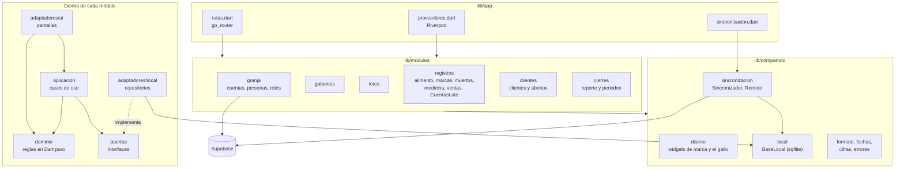
```mermaid
flowchart TB
  subgraph app["lib/app"]
    rutas["rutas.dart<br/>go_router"]
    prov["proveedores.dart<br/>Riverpod"]
    sinc["sincronizacion.dart"]
  end

  subgraph modulos["lib/modulos"]
    direction LR
    granja["granja<br/>cuentas, personas, roles"]
    galpones["galpones"]
    lotes["lotes"]
    registros["registros<br/>alimento, marcas, muertos,<br/>medicina, ventas, CuentasLote"]
    clientes["clientes<br/>clientes y abonos"]
    cierres["cierres<br/>reporte y periodos"]
  end

  subgraph capas["Dentro de cada módulo"]
    direction LR
    ui["adaptadores/ui<br/>pantallas"] --> aplicacion["aplicacion<br/>casos de uso"]
    ui --> dominio["dominio<br/>reglas en Dart puro"]
    aplicacion --> dominio
    aplicacion --> puertos["puertos<br/>interfaces"]
    local["adaptadores/local<br/>repositorios"] -. implementa .-> puertos
  end

  subgraph compartido["lib/compartido"]
    direction LR
    diseno["diseno<br/>widgets de marca y el gallo"]
    base["local<br/>BaseLocal (sqflite)"]
    sincro["sincronizacion<br/>Sincronizador, Remoto"]
    utiles["formato, fechas,<br/>cifras, errores"]
  end

  rutas --> modulos
  prov --> modulos
  modulos --> compartido
  local --> base
  sinc --> sincro
  sincro --> base
  sincro --> supa[("Supabase")]
  granja --> supa
```

## 2. Cómo trabaja sin señal

Todo se guarda primero en el celular. El sincronizador sube la cola en orden y
después baja lo que cambiaron los demás.

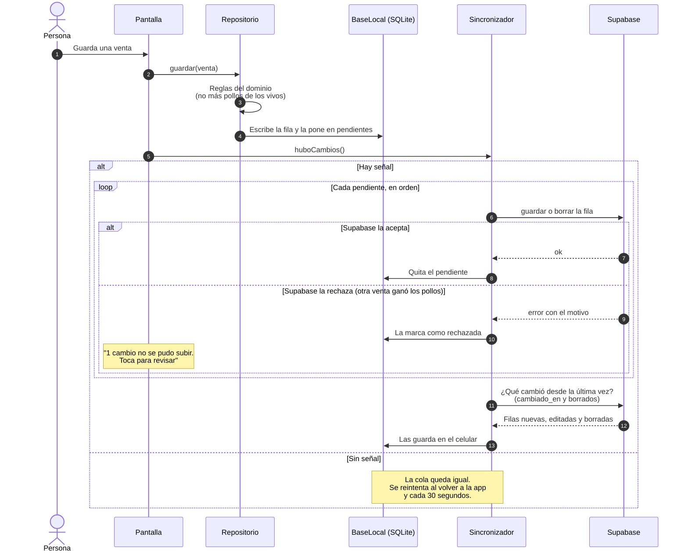
```mermaid
sequenceDiagram
  autonumber
  actor P as Persona
  participant UI as Pantalla
  participant R as Repositorio
  participant L as BaseLocal (SQLite)
  participant S as Sincronizador
  participant DB as Supabase

  P->>UI: Guarda una venta
  UI->>R: guardar(venta)
  R->>R: Reglas del dominio<br/>(no más pollos de los vivos)
  R->>L: Escribe la fila y la pone en pendientes
  UI->>S: huboCambios()

  alt Hay señal
    loop Cada pendiente, en orden
      S->>DB: guardar o borrar la fila
      alt Supabase la acepta
        DB-->>S: ok
        S->>L: Quita el pendiente
      else Supabase la rechaza (otra venta ganó los pollos)
        DB-->>S: error con el motivo
        S->>L: La marca como rechazada
        Note over UI: "1 cambio no se pudo subir.<br/>Toca para revisar"
      end
    end
    S->>DB: ¿Qué cambió desde la última vez?<br/>(cambiado_en y borrados)
    DB-->>S: Filas nuevas, editadas y borradas
    S->>L: Las guarda en el celular
  else Sin señal
    Note over S,L: La cola queda igual.<br/>Se reintenta al volver a la app<br/>y cada 30 segundos.
  end
```

## 3. Modelo de datos

Todas las tablas del negocio llevan `granja_id`, y las reglas por fila (RLS)
solo muestran las de las granjas de la persona. Además tienen `creado_por`,
`creado_en`, `actualizado_por`, `actualizado_en` y `cambiado_en`, que no se
repiten en el diagrama.

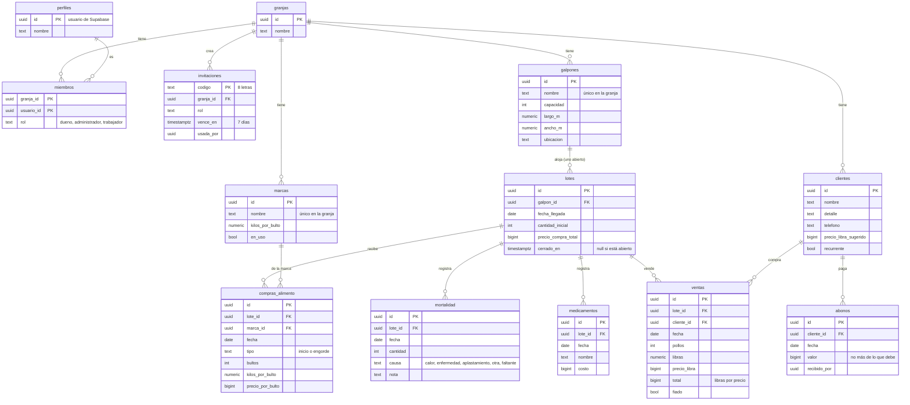
```mermaid
erDiagram
  granjas ||--o{ miembros : tiene
  perfiles ||--o{ miembros : "es"
  granjas ||--o{ invitaciones : crea
  granjas ||--o{ galpones : tiene
  granjas ||--o{ marcas : tiene
  granjas ||--o{ clientes : tiene
  galpones ||--o{ lotes : "aloja (uno abierto)"
  lotes ||--o{ compras_alimento : recibe
  marcas ||--o{ compras_alimento : "de la marca"
  lotes ||--o{ mortalidad : registra
  lotes ||--o{ medicamentos : registra
  lotes ||--o{ ventas : vende
  clientes ||--o{ ventas : compra
  clientes ||--o{ abonos : paga

  granjas {
    uuid id PK
    text nombre
  }
  perfiles {
    uuid id PK "usuario de Supabase"
    text nombre
  }
  miembros {
    uuid granja_id PK
    uuid usuario_id PK
    text rol "dueno, administrador, trabajador"
  }
  invitaciones {
    text codigo PK "8 letras"
    uuid granja_id FK
    text rol
    timestamptz vence_en "7 días"
    uuid usada_por
  }
  galpones {
    uuid id PK
    text nombre "único en la granja"
    int capacidad
    numeric largo_m
    numeric ancho_m
    text ubicacion
  }
  lotes {
    uuid id PK
    uuid galpon_id FK
    date fecha_llegada
    int cantidad_inicial
    bigint precio_compra_total
    timestamptz cerrado_en "null si está abierto"
  }
  marcas {
    uuid id PK
    text nombre "único en la granja"
    numeric kilos_por_bulto
    bool en_uso
  }
  compras_alimento {
    uuid id PK
    uuid lote_id FK
    uuid marca_id FK
    date fecha
    text tipo "inicio o engorde"
    int bultos
    numeric kilos_por_bulto
    bigint precio_por_bulto
  }
  mortalidad {
    uuid id PK
    uuid lote_id FK
    date fecha
    int cantidad
    text causa "calor, enfermedad, aplastamiento, otra, faltante"
    text nota
  }
  medicamentos {
    uuid id PK
    uuid lote_id FK
    date fecha
    text nombre
    bigint costo
  }
  clientes {
    uuid id PK
    text nombre
    text detalle
    text telefono
    bigint precio_libra_sugerido
    bool recurrente
  }
  ventas {
    uuid id PK
    uuid lote_id FK
    uuid cliente_id FK
    date fecha
    int pollos
    numeric libras
    bigint precio_libra
    bigint total "libras por precio"
    bool fiado
  }
  abonos {
    uuid id PK
    uuid cliente_id FK
    date fecha
    bigint valor "no más de lo que debe"
    uuid recibido_por
  }
```

La tabla `borrados` (tabla, fila_id, granja_id, borrado_en) anota cada fila que
se borra, para que los celulares que estaban sin señal también la quiten. Las
vistas `resumen_lotes` y `saldo_clientes` calculan los totales en el servidor.

## 4. A qué pantalla entra cada persona

`_destino` en `lib/app/rutas.dart` decide la pantalla cada vez que cambia la
sesión, el nombre o las granjas.

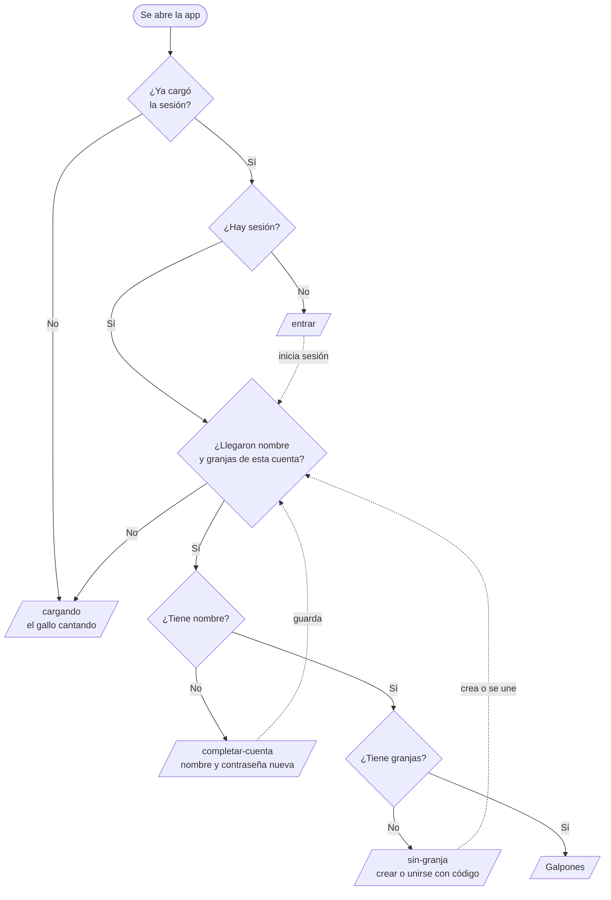
```mermaid
flowchart TD
  inicio([Se abre la app]) --> sesion{¿Ya cargó<br/>la sesión?}
  sesion -- No --> cargando[/cargando<br/>el gallo cantando/]
  sesion -- Sí --> hay{¿Hay sesión?}
  hay -- No --> entrar[/entrar/]
  hay -- Sí --> datos{¿Llegaron nombre<br/>y granjas de esta cuenta?}
  datos -- No --> cargando
  datos -- Sí --> nombre{¿Tiene nombre?}
  nombre -- No --> completar[/completar-cuenta<br/>nombre y contraseña nueva/]
  nombre -- Sí --> granjas{¿Tiene granjas?}
  granjas -- No --> sin[/sin-granja<br/>crear o unirse con código/]
  granjas -- Sí --> galpones[/ Galpones /]

  entrar -. inicia sesión .-> datos
  completar -. guarda .-> datos
  sin -. crea o se une .-> datos
```

## 5. Pantallas

Las tres secciones de la barra de abajo y a dónde se llega desde cada una.

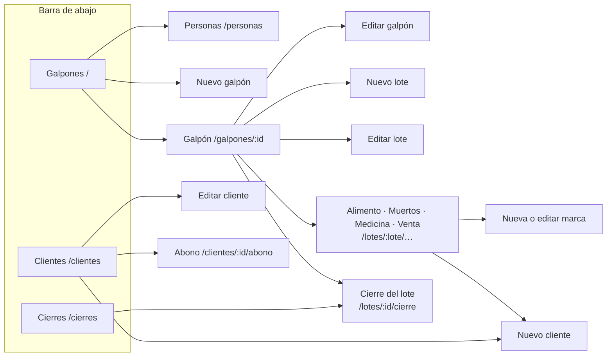
```mermaid
flowchart LR
  subgraph barra["Barra de abajo"]
    G["Galpones /"]
    C["Clientes /clientes"]
    X["Cierres /cierres"]
  end

  G --> P["Personas /personas"]
  G --> GN["Nuevo galpón"]
  G --> GD["Galpón /galpones/:id"]
  GD --> GE["Editar galpón"]
  GD --> LN["Nuevo lote"]
  GD --> LE["Editar lote"]
  GD --> REG["Alimento · Muertos · Medicina · Venta<br/>/lotes/:lote/…"]
  GD --> CL["Cierre del lote<br/>/lotes/:id/cierre"]
  REG --> MA["Nueva o editar marca"]
  REG --> CN["Nuevo cliente"]

  C --> CN
  C --> CE["Editar cliente"]
  C --> AB["Abono /clientes/:id/abono"]

  X --> CL
```

## 6. Vida de un lote

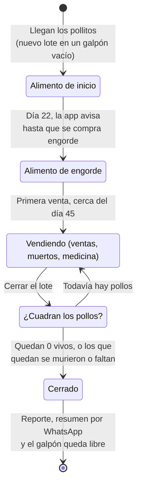
```mermaid
stateDiagram-v2
  [*] --> Inicio: Llegan los pollitos<br/>(nuevo lote en un galpón vacío)
  Inicio --> Engorde: Día 22, la app avisa<br/>hasta que se compra engorde
  Inicio: Alimento de inicio
  Engorde: Alimento de engorde
  Engorde --> Vendiendo: Primera venta, cerca del día 45
  Vendiendo: Vendiendo (ventas, muertos, medicina)
  Vendiendo --> Cuadrar: Cerrar el lote
  Cuadrar: ¿Cuadran los pollos?
  Cuadrar --> Cerrado: Quedan 0 vivos, o los que<br/>quedan se murieron o faltan
  Cuadrar --> Vendiendo: Todavía hay pollos
  Cerrado --> [*]: Reporte, resumen por WhatsApp<br/>y el galpón queda libre
```

## 7. De un cambio al celular

Pasos completos en [publicar-una-version.md](publicar-una-version.md).

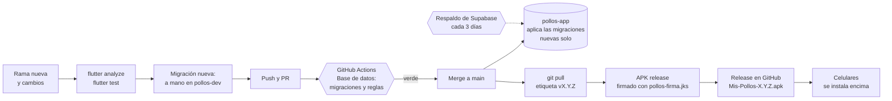
```mermaid
flowchart LR
  rama["Rama nueva<br/>y cambios"] --> pruebas["flutter analyze<br/>flutter test"]
  pruebas --> dev["Migración nueva:<br/>a mano en pollos-dev"]
  dev --> pr["Push y PR"]
  pr --> ci{{"GitHub Actions<br/>Base de datos:<br/>migraciones y reglas"}}
  ci -- verde --> merge["Merge a main"]
  merge --> supa[("pollos-app<br/>aplica las migraciones<br/>nuevas solo")]
  merge --> tag["git pull<br/>etiqueta vX.Y.Z"]
  tag --> apk["APK release<br/>firmado con pollos-firma.jks"]
  apk --> release["Release en GitHub<br/>Mis-Pollos-X.Y.Z.apk"]
  release --> cel["Celulares<br/>se instala encima"]
  respaldo{{"Respaldo de Supabase<br/>cada 3 días"}} -.-> supa
```

## 8. Quién puede hacer qué

Lo hacen cumplir las reglas por fila de Supabase. La app además esconde los
botones que un rol no puede usar.

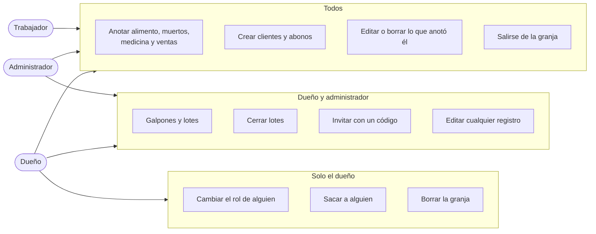
```mermaid
flowchart LR
  D(["Dueño"])
  A(["Administrador"])
  T(["Trabajador"])

  subgraph todos["Todos"]
    reg["Anotar alimento, muertos,<br/>medicina y ventas"]
    cli["Crear clientes y abonos"]
    suyo["Editar o borrar lo que anotó él"]
    salir["Salirse de la granja"]
  end
  subgraph admin["Dueño y administrador"]
    gal["Galpones y lotes"]
    cerrar["Cerrar lotes"]
    inv["Invitar con un código"]
    otro["Editar cualquier registro"]
  end
  subgraph dueno["Solo el dueño"]
    rol["Cambiar el rol de alguien"]
    sacar["Sacar a alguien"]
    borrar["Borrar la granja"]
  end

  T --> todos
  A --> todos
  A --> admin
  D --> todos
  D --> admin
  D --> dueno
```

## 9. Cuentas, granjas e invitaciones

Los registros públicos están cerrados: cada cuenta la crea el dueño en Supabase.

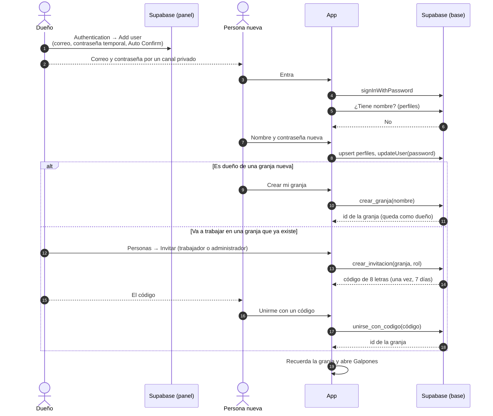
```mermaid
sequenceDiagram
  autonumber
  actor Du as Dueño
  participant SB as Supabase (panel)
  actor Pe as Persona nueva
  participant App as App
  participant DB as Supabase (base)

  Du->>SB: Authentication → Add user<br/>(correo, contraseña temporal, Auto Confirm)
  Du-->>Pe: Correo y contraseña por un canal privado
  Pe->>App: Entra
  App->>DB: signInWithPassword
  App->>DB: ¿Tiene nombre? (perfiles)
  DB-->>App: No
  Pe->>App: Nombre y contraseña nueva
  App->>DB: upsert perfiles, updateUser(password)

  alt Es dueño de una granja nueva
    Pe->>App: Crear mi granja
    App->>DB: crear_granja(nombre)
    DB-->>App: id de la granja (queda como dueño)
  else Va a trabajar en una granja que ya existe
    Du->>App: Personas → Invitar (trabajador o administrador)
    App->>DB: crear_invitacion(granja, rol)
    DB-->>App: código de 8 letras (una vez, 7 días)
    Du-->>Pe: El código
    Pe->>App: Unirme con un código
    App->>DB: unirse_con_codigo(código)
    DB-->>App: id de la granja
  end
  App->>App: Recuerda la granja y abre Galpones
```

## 10. Clases del dominio

Todo en Dart puro. Cada clase tiene dos formas de crearse: `.nueva()` revisa
las reglas y lanza su excepción con el `campo` del error; `.reconstruir()`
arma el objeto con lo que ya está guardado, sin revisar.

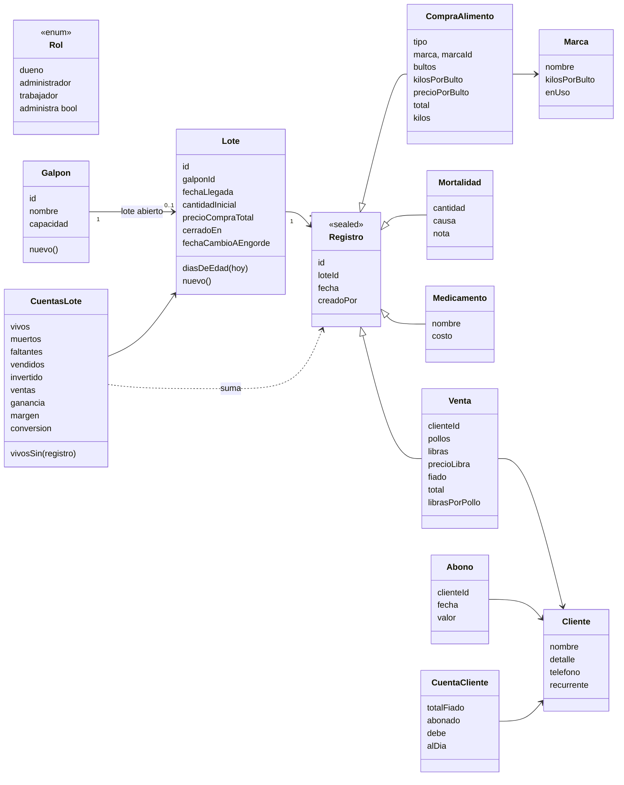
```mermaid
classDiagram
  direction LR
  class Rol {
    <<enum>>
    dueno
    administrador
    trabajador
    administra bool
  }
  class Galpon {
    id
    nombre
    capacidad
    nuevo()
  }
  class Lote {
    id
    galponId
    fechaLlegada
    cantidadInicial
    precioCompraTotal
    cerradoEn
    diasDeEdad(hoy)
    fechaCambioAEngorde
    nuevo()
  }
  class Registro {
    <<sealed>>
    id
    loteId
    fecha
    creadoPor
  }
  class CompraAlimento {
    tipo
    marca, marcaId
    bultos
    kilosPorBulto
    precioPorBulto
    total
    kilos
  }
  class Mortalidad {
    cantidad
    causa
    nota
  }
  class Medicamento {
    nombre
    costo
  }
  class Venta {
    clienteId
    pollos
    libras
    precioLibra
    fiado
    total
    librasPorPollo
  }
  class Marca {
    nombre
    kilosPorBulto
    enUso
  }
  class Cliente {
    nombre
    detalle
    telefono
    recurrente
  }
  class Abono {
    clienteId
    fecha
    valor
  }
  class CuentaCliente {
    totalFiado
    abonado
    debe
    alDia
  }
  class CuentasLote {
    vivos
    muertos
    faltantes
    vendidos
    invertido
    ventas
    ganancia
    margen
    conversion
    vivosSin(registro)
  }

  Registro <|-- CompraAlimento
  Registro <|-- Mortalidad
  Registro <|-- Medicamento
  Registro <|-- Venta
  Galpon "1" --> "0..1" Lote : lote abierto
  Lote "1" --> "*" Registro
  CompraAlimento --> Marca
  Venta --> Cliente
  Abono --> Cliente
  CuentaCliente --> Cliente
  CuentasLote --> Lote
  CuentasLote ..> Registro : suma
```

## 11. Las cuentas del lote

`CuentasLote(lote, registros)` recorre los registros del lote una vez y saca
todo lo que muestran el galpón y el cierre.

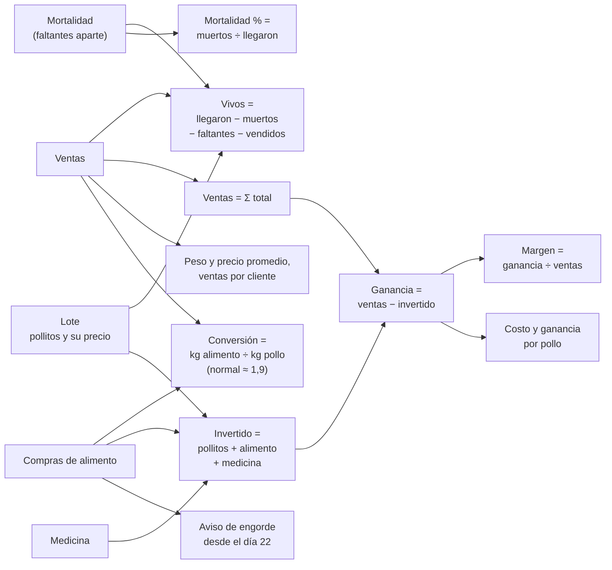
```mermaid
flowchart LR
  L["Lote<br/>pollitos y su precio"]
  M["Mortalidad<br/>(faltantes aparte)"]
  V["Ventas"]
  CA["Compras de alimento"]
  ME["Medicina"]

  vivos["Vivos =<br/>llegaron − muertos<br/>− faltantes − vendidos"]
  mort["Mortalidad % =<br/>muertos ÷ llegaron"]
  ventas["Ventas = Σ total"]
  otros["Peso y precio promedio,<br/>ventas por cliente"]
  conv["Conversión =<br/>kg alimento ÷ kg pollo<br/>(normal ≈ 1,9)"]
  inv["Invertido =<br/>pollitos + alimento<br/>+ medicina"]
  etapa["Aviso de engorde<br/>desde el día 22"]

  gan["Ganancia =<br/>ventas − invertido"]
  margen["Margen =<br/>ganancia ÷ ventas"]
  porPollo["Costo y ganancia<br/>por pollo"]

  L --> vivos
  M --> vivos
  V --> vivos
  M --> mort
  V --> ventas
  V --> otros
  V --> conv
  CA --> conv
  CA --> inv
  L --> inv
  ME --> inv
  CA --> etapa
  ventas --> gan
  inv --> gan
  gan --> margen
  gan --> porPollo
```

## 12. Fiado y abonos

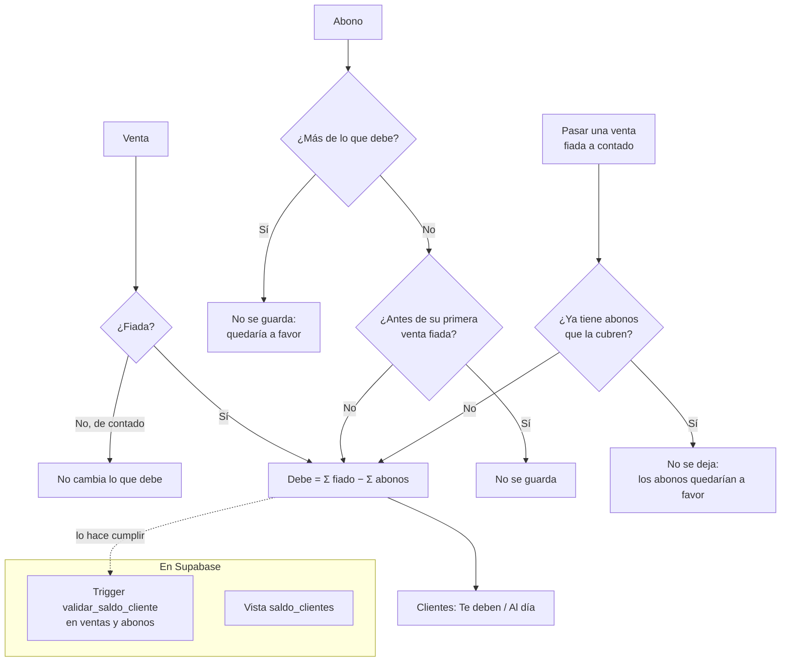
```mermaid
flowchart TD
  venta["Venta"] --> f{¿Fiada?}
  f -- No, de contado --> fin["No cambia lo que debe"]
  f -- Sí --> debe["Debe = Σ fiado − Σ abonos"]
  abono["Abono"] --> r1{¿Más de lo que debe?}
  r1 -- Sí --> no1["No se guarda:<br/>quedaría a favor"]
  r1 -- No --> r2{¿Antes de su primera<br/>venta fiada?}
  r2 -- Sí --> no2["No se guarda"]
  r2 -- No --> debe
  cambio["Pasar una venta<br/>fiada a contado"] --> r3{¿Ya tiene abonos<br/>que la cubren?}
  r3 -- Sí --> no3["No se deja:<br/>los abonos quedarían a favor"]
  r3 -- No --> debe
  debe --> lista["Clientes: Te deben / Al día"]

  subgraph base["En Supabase"]
    trig["Trigger validar_saldo_cliente<br/>en ventas y abonos"]
    vista["Vista saldo_clientes"]
  end
  debe -. lo hace cumplir .-> trig
```

## 13. Guardar algo, paso a paso

Así funciona cualquier formulario. El ejemplo es anotar muertos
(`pantalla_muertos.dart`).

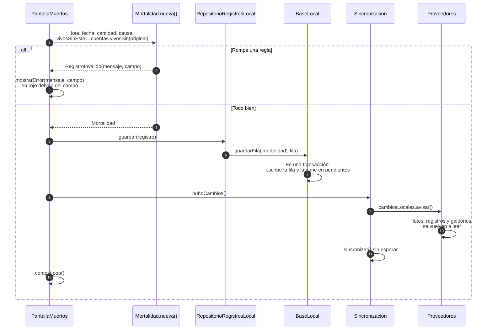
```mermaid
sequenceDiagram
  autonumber
  participant UI as PantallaMuertos
  participant Dom as Mortalidad.nueva()
  participant Rep as RepositorioRegistrosLocal
  participant BL as BaseLocal
  participant Sin as Sincronizacion
  participant Prov as Proveedores

  UI->>Dom: lote, fecha, cantidad, causa,<br/>vivosSinEste = cuentas.vivosSin(original)
  alt Rompe una regla
    Dom-->>UI: RegistroInvalido(mensaje, campo)
    UI->>UI: mostrarError(mensaje, campo)<br/>en rojo debajo del campo
  else Todo bien
    Dom-->>UI: Mortalidad
    UI->>Rep: guardar(registro)
    Rep->>BL: guardarFila('mortalidad', fila)
    BL->>BL: En una transacción:<br/>escribe la fila y la pone en pendientes
    UI->>Sin: huboCambios()
    Sin->>Prov: cambiosLocales.avisar()
    Prov->>Prov: lotes, registros y galpones<br/>se vuelven a leer
    Sin->>Sin: sincronizar() sin esperar
    UI->>UI: context.pop()
  end
```

## 14. Estados de un cambio pendiente

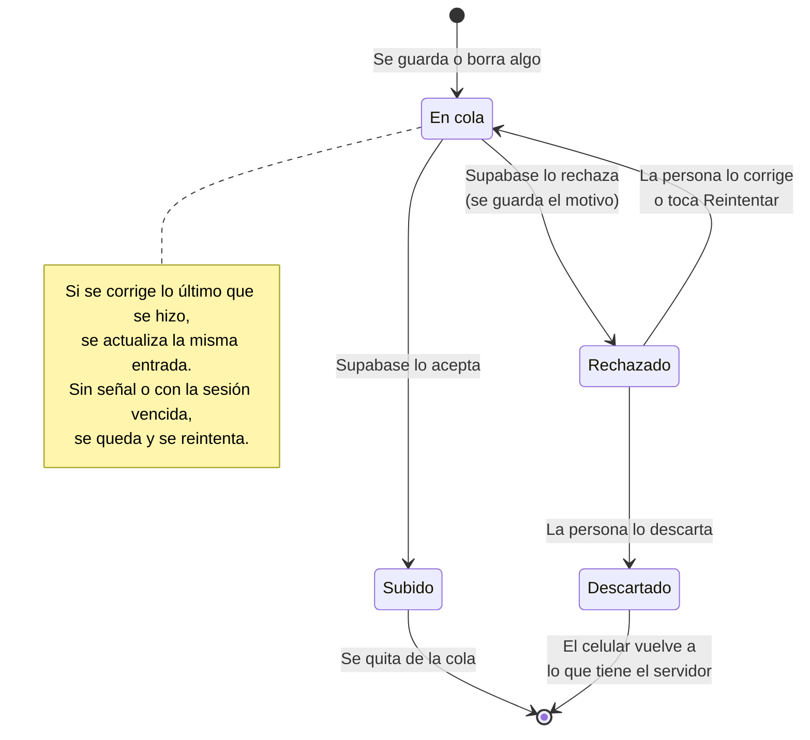
```mermaid
stateDiagram-v2
  [*] --> EnCola: Se guarda o borra algo
  EnCola: En cola
  note right of EnCola
    Si se corrige lo último que se hizo,
    se actualiza la misma entrada.
    Sin señal o con la sesión vencida,
    se queda y se reintenta.
  end note
  EnCola --> Subido: Supabase lo acepta
  Subido --> [*]: Se quita de la cola
  EnCola --> Rechazado: Supabase lo rechaza<br/>(se guarda el motivo)
  Rechazado --> EnCola: La persona lo corrige<br/>o toca Reintentar
  Rechazado --> Descartado: La persona lo descarta
  Descartado --> [*]: El celular vuelve a<br/>lo que tiene el servidor
```

## 15. La base del celular

`BaseLocal` (sqflite, versión 4). Las tablas del negocio son copias de las de
Supabase con las columnas de `columnasLocales`. Los booleanos se guardan como
1 y 0 (`columnasSiNo`).

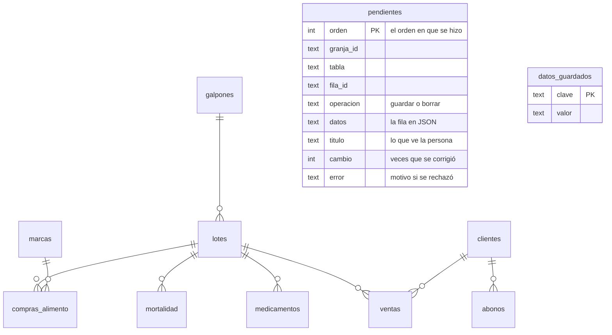
```mermaid
erDiagram
  galpones ||--o{ lotes : ""
  lotes ||--o{ compras_alimento : ""
  lotes ||--o{ mortalidad : ""
  lotes ||--o{ medicamentos : ""
  lotes ||--o{ ventas : ""
  clientes ||--o{ ventas : ""
  clientes ||--o{ abonos : ""
  marcas ||--o{ compras_alimento : ""

  pendientes {
    int orden PK "el orden en que se hizo"
    text granja_id
    text tabla
    text fila_id
    text operacion "guardar o borrar"
    text datos "la fila en JSON"
    text titulo "lo que ve la persona"
    int cambio "veces que se corrigió"
    text error "motivo si se rechazó"
  }
  datos_guardados {
    text clave PK
    text valor
  }
```

`datos_guardados` guarda lo último que se bajó de la cuenta (`nombre:<usuario>`,
`granjas:<usuario>`, `miembros:<granja>`), la granja elegida
(`granja:<usuario>`) y hasta cuándo se bajó cada tabla
(`bajado:<granja>:<tabla>`). Así la app abre sin señal.

## 16. Cómo se conectan los proveedores

Riverpod en `lib/app/proveedores.dart`. Cuando algo de arriba cambia, todo lo
que depende de él se vuelve a calcular.

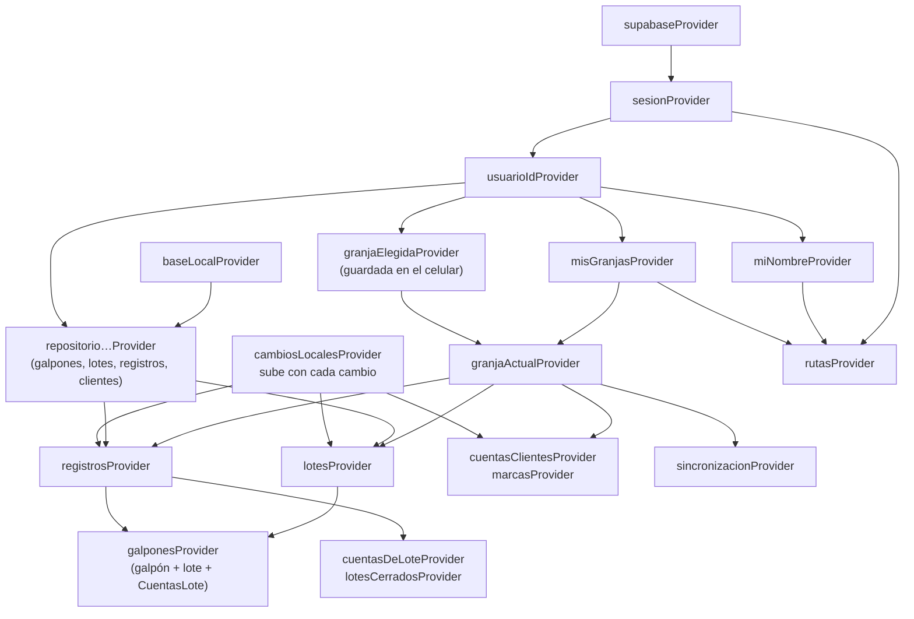
```mermaid
flowchart TD
  supa["supabaseProvider"] --> sesion["sesionProvider"]
  sesion --> usuario["usuarioIdProvider"]
  usuario --> nombre["miNombreProvider"]
  usuario --> granjas["misGranjasProvider"]
  usuario --> elegida["granjaElegidaProvider<br/>(guardada en el celular)"]
  granjas --> actual["granjaActualProvider"]
  elegida --> actual

  base["baseLocalProvider"] --> repos["repositorio…Provider<br/>(galpones, lotes, registros, clientes)"]
  usuario --> repos
  cambios["cambiosLocalesProvider<br/>sube con cada cambio"]

  actual --> lotes["lotesProvider"]
  actual --> registros["registrosProvider"]
  repos --> lotes
  repos --> registros
  cambios --> lotes
  cambios --> registros
  lotes --> galpones["galponesProvider<br/>(galpón + lote + CuentasLote)"]
  registros --> galpones
  registros --> cuentasLote["cuentasDeLoteProvider<br/>lotesCerradosProvider"]
  actual --> clientes["cuentasClientesProvider<br/>marcasProvider"]
  cambios --> clientes
  actual --> sinc["sincronizacionProvider"]

  sesion --> rutas["rutasProvider"]
  nombre --> rutas
  granjas --> rutas
```

## 17. Infraestructura

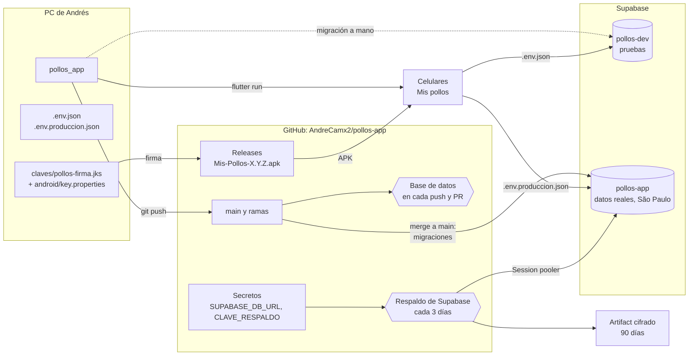
```mermaid
flowchart LR
  subgraph pc["PC de Andrés"]
    code["pollos_app"]
    envs[".env.json<br/>.env.produccion.json"]
    llave["claves/pollos-firma.jks<br/>+ android/key.properties"]
  end

  subgraph gh["GitHub: AndreCamx2/pollos-app"]
    repo["main y ramas"]
    ci{{"Base de datos<br/>en cada push y PR"}}
    resp{{"Respaldo de Supabase<br/>cada 3 días"}}
    rel["Releases<br/>Mis-Pollos-X.Y.Z.apk"]
    sec["Secretos<br/>SUPABASE_DB_URL, CLAVE_RESPALDO"]
  end

  subgraph supabase["Supabase"]
    dev[("pollos-dev<br/>pruebas")]
    prod[("pollos-app<br/>datos reales, São Paulo")]
  end

  cel["Celulares<br/>Mis pollos"]

  code -- git push --> repo
  repo --> ci
  repo -- merge a main:<br/>migraciones --> prod
  code -. migración a mano .-> dev
  code -- flutter run --> cel
  cel -- .env.json --> dev
  llave -- firma --> rel
  rel -- APK --> cel
  cel -- .env.produccion.json --> prod
  sec --> resp
  resp -- Session pooler --> prod
  resp --> art["Artifact cifrado<br/>90 días"]
```

## 18. El respaldo

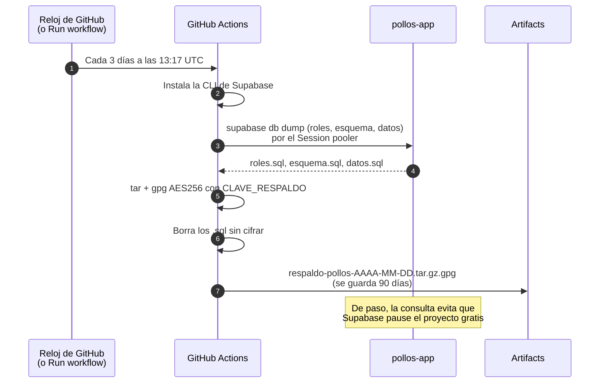
```mermaid
sequenceDiagram
  autonumber
  participant R as Reloj de GitHub<br/>(o Run workflow)
  participant A as GitHub Actions
  participant DB as pollos-app
  participant G as Artifacts

  R->>A: Cada 3 días a las 13:17 UTC
  A->>A: Instala la CLI de Supabase
  A->>DB: supabase db dump (roles, esquema, datos)<br/>por el Session pooler
  DB-->>A: roles.sql, esquema.sql, datos.sql
  A->>A: tar + gpg AES256 con CLAVE_RESPALDO
  A->>A: Borra los .sql sin cifrar
  A->>G: respaldo-pollos-AAAA-MM-DD.tar.gz.gpg<br/>(se guarda 90 días)
  Note over DB: De paso, la consulta evita que<br/>Supabase pause el proyecto gratis
```

## 19. Cómo se protege cada dato

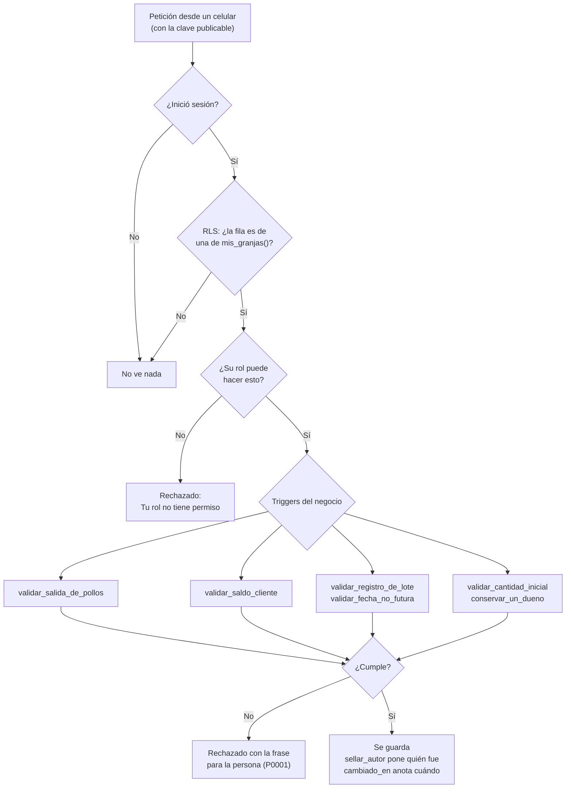
```mermaid
flowchart TD
  pet["Petición desde un celular<br/>(con la clave publicable)"] --> auth{¿Inició sesión?}
  auth -- No --> fuera["No ve nada"]
  auth -- Sí --> rls{"RLS: ¿la fila es de<br/>una de mis_granjas()?"}
  rls -- No --> fuera
  rls -- Sí --> perm{"¿Su rol puede<br/>hacer esto?"}
  perm -- No --> fuera2["Rechazado:<br/>Tu rol no tiene permiso"]
  perm -- Sí --> trig{"Triggers del negocio"}
  trig --> t1["validar_salida_de_pollos"]
  trig --> t2["validar_saldo_cliente"]
  trig --> t3["validar_registro_de_lote<br/>validar_fecha_no_futura"]
  trig --> t4["validar_cantidad_inicial<br/>conservar_un_dueno"]
  t1 & t2 & t3 & t4 --> ok{¿Cumple?}
  ok -- No --> msg["Rechazado con la frase<br/>para la persona (P0001)"]
  ok -- Sí --> guarda["Se guarda<br/>sellar_autor pone quién fue<br/>cambiado_en anota cuándo"]
```
